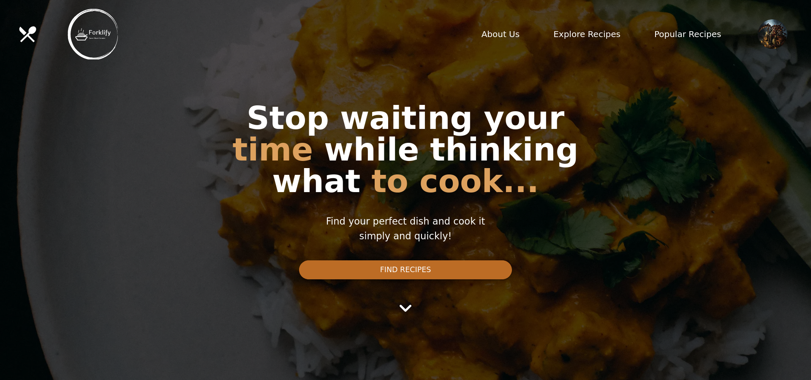
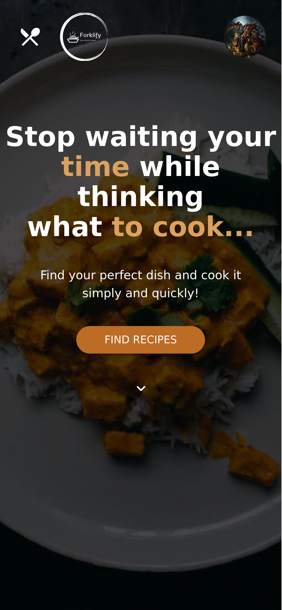
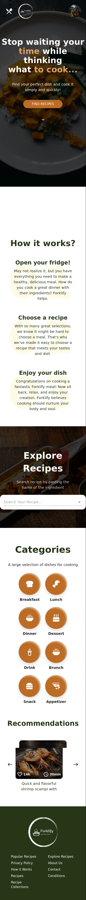

<!-- Project Shields -->

  
  
  
  

<!-- Project Logo -->
 

  

  <h3 align="center">
  	Forklify - Global Recipe Sharing Platform
  </h3>

  

    Forklify is a vibrant online community that unites culinary enthusiasts worldwide. This innovative recipe sharing platform empowers cooks to showcase their culinary creations and explore a diverse range of dishes curated by fellow food enthusiasts
     
    <a
      href="https://forklify-six.vercel.app/"
      aria-label="Link to issues of github repo"
      >
      View Demo
      </a>
    <a
      href="https://github.com/ujjwalgarg100204/forklify/issues"
      aria-label="Link to issues of github repo"
      >Report Bug</a
    >
    ·
    <a
      href="https://github.com/ujjwalgarg100204/forklify/issues"
      aria-label="Link to issues of github repo"
      >Request Feature</a
    >
  

<!-- TABLE OF CONTENTS -->

  
Table of Contents

  <ol>
    <li>
      <a href="#about-the-project">About The Project</a>
      <ul>
        <li><a href="#built-with">Built With</a></li>
      </ul>
    </li>
    <li><a href="#usage">Usage</a></li>
    <li><a href="#contributing">Contributing</a></li>
    <li><a href="#license">License</a></li>
    <li><a href="#links">Links</a></li>
    <li><a href="#author">Author</a></li>
    <li><a href="#acknowledgments">Acknowledgments</a></li>
  </ol>

<!-- ABOUT THE PROJECT -->
<h2>About The Project</h2>

#### Key Features

-   `User-Centric Profiles`:
    Members can create personalized profiles, showcasing their culinary expertise, favorite recipes, and cooking styles.

-   `Recipe Sharing`:
    Users can effortlessly upload, format, and share their original recipes, complete with captivating visuals and step-by-step instructions.

-   `Bookmark & Collections`:
    Cooks can bookmark favorite recipes and curate bespoke collections for easy access and inspiration.

-   `Interactive Commenting`:
    Foster a dynamic culinary conversation by leaving comments, feedback, and tips on recipes shared by others.

-   `Intuitive Search & Filter`:
    Discover recipes based on cuisine, dietary preferences, ingredients, and difficulty level.

#### Desktop Design

  

#### Mobile Design

	 
  
  

(<a href="#readme-top">back to top</a>)

<!-- USAGE EXAMPLES -->

## Usage

Forklify offers a seamless platform for culinary enthusiasts to share, discover, and connect over delectable recipes. Create your profile, showcase your culinary creations, and explore a diverse array of dishes curated by fellow food enthusiasts. Bookmark your favorite recipes, curate bespoke collections, and engage with the community through interactive comments. Receive real-time updates with push notifications, and easily search for recipes based on your preferences. Join us in celebrating the art of cooking and the joy of sharing delicious creations with like-minded individuals.

(<a href="#readme-top">back to top</a>)

<!-- Built With -->

### Built With

-   **Next JS**
-   **lottie**
-   **next-auth**
-   **axios**
-   **pure-react-carousel**
-   **swr**
-   **zod**
-   **vitest**

(<a href="#readme-top">back to top</a>)

<!-- CONTRIBUTING -->

## Contributing

Contributions are what make the open source community such an amazing place to learn, inspire, and create. Any contributions you make are **greatly appreciated**.

If you have a suggestion that would make this better, please fork the repo and create a pull request. You can also simply open an issue with the tag "enhancement".
Don't forget to give the project a star! Thanks again!

1. Fork the Project
2. Create your Feature Branch (`git checkout -b feature/AmazingFeature`)
3. Commit your Changes (`git commit -m 'Add some AmazingFeature'`)
4. Push to the Branch (`git push origin feature/AmazingFeature`)
5. Open a Pull Request

(<a href="#readme-top">back to top</a>)

<!-- LICENSE -->

## License

Distributed under the MIT License. See `LICENSE.txt` for more information.

(<a href="#readme-top">back to top</a>)

## Links

-   Repo URL: [https://github.com/ujjwalgarg100204/forklify](https://github.com/ujjwalgarg100204/forklify)
-   Live Site URL: [https://forklify-six.vercel.app/](https://forklify-six.vercel.app/)

<!-- AUTHOR -->

## Author

-   Website - [Ujjwal Garg](https://github.com/ujjwalgarg100204)
-   Instagram - [@ujjwalgarg100204](https://www.instagram.com/ujjwalgarg100204/)
-   Linkedin - [@ujjwalgarg100204](https://www.linkedin.com/in/ujjwal-garg-3a5639243/)
-   Twitter -[@UjwalGarg100204](https://twitter.com/UjwalGarg100204)

## Acknowledgements

Other devs who worked with me

  
  
Harsh

  
  
Naman

(<a href="#readme-top">back to top</a>)

